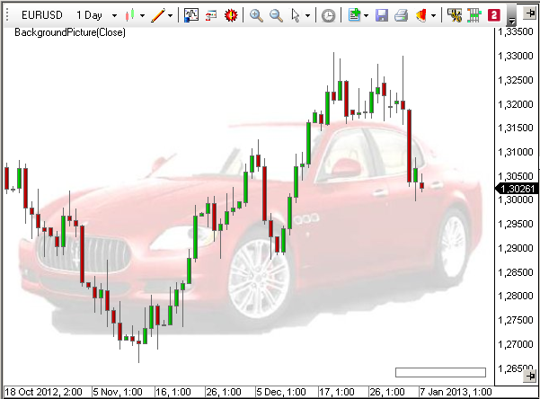
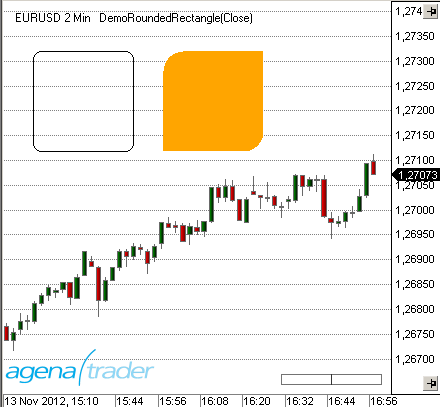

# Hints & Advice

## Bar Numbering Within the Chart
The following example demonstrates the usage of the plot method and the properties of the [*ChartControl*](#chartcontrol) object.


**Note:**
For demonstration purposes, each time Paint is called up within the “Bar Numbering” section, “New” and “Dispose” will also be called up multiple times.
From a performance point of view, this solution can be better implemented by using constant variable declarations and calling up “Dispose” within the OnTermination statement.
```cs
using System;
using System.Collections.Generic;
using System.ComponentModel;
using System.Drawing;
using System.Drawing.Drawing2D;
using System.Linq;
using System.Xml;
using System.Xml.Serialization;
using AgenaTrader.API;
using AgenaTrader.Custom;
using AgenaTrader.Plugins;
using AgenaTrader.Helper;
namespace AgenaTrader.UserCode
{
[Description("PlotSample")]
public class PlotSample : UserIndicator
{
Pen pen = new Pen(Color.Blue);
StringFormat sf = new StringFormat();
SolidBrush brush = new SolidBrush(Color.Black);
Font font = new Font("Arial", 10, FontStyle.Bold);
protected override void Initialize()
{
Overlay = true;
}
protected override void OnTermination()
{
if (pen!=null) pen.Dispose();
if (sf!=null) sf.Dispose();
if (brush!=null) brush.Dispose();
if (font!=null) font.Dispose();
}
protected override void OnBarUpdate()
{}
public override void Plot(Graphics g, Rectangle r, double min, double max)
{
if (Bars == null || ChartControl == null) return;
// Properties of ChartControl
string s;
s = "bounds: "+r.X.ToString()+" "+r.Y.ToString()+" "+r.Height.ToString()+" "+r.Width.ToString();
g.DrawString(s, font, brush, 10, 50, sf);
s = "min: "+Instrument.Round2TickSize(min).ToString()+" max: "+Instrument.Round2TickSize(max).ToString();
g.DrawString(s, font, brush, 10, 70, sf);
s = "BarSpace: "+ChartControl.BarSpace.ToString()+" BarWidth: "+ChartControl.BarWidth.ToString();
g.DrawString(s, font, brush, 10, 90, sf);
s = "Bars.Count: "+Bars.Count.ToString();
g.DrawString(s, font, brush, 10, 110, sf);
s = "BarsPainted: "+ChartControl.BarsPainted.ToString() + " FirstBarPainted: "+ChartControl.FirstBarPainted.ToString() + " LastBarPainted: "+ChartControl.LastBarPainted.ToString();
g.DrawString(s, font, brush, 10, 130, sf);
s = "BarsVisible: "+ChartControl.BarsVisible.ToString() + " FirstBarVisible: "+ChartControl.FirstBarVisible.ToString() + " LastBarVisible: "+ChartControl.LastBarVisible.ToString();
g.DrawString(s, font, brush, 10, 150, sf);
// Bar numbering
StringFormat _sf = new StringFormat();
SolidBrush _brush = new SolidBrush(Color.Blue);
Font _font = new Font("Arial", 8);
SizeF _stringSize = new SizeF();
_sf.Alignment = StringAlignment.Center;
for (int i=ChartControl.FirstBarVisible; i<=ChartControl.LastBarVisible; i++)
{
string text = i.ToString();
_stringSize = g.MeasureString(text, _font);
int x = ChartControl.GetXByBarIdx(Bars, i);
int y = ChartControl.GetYByValue(this, High[Abs2Ago(i)] + 3*TickSize) - (int) _stringSize.Height;
g.DrawString(text, _font, _brush, x, y, _sf);
}
_sf.Dispose();
_brush.Dispose();
_font.Dispose();
}
private int Abs2Ago(int idx)
{
return Math.Max(0,Bars.Count-idx-1-(CalculateOnBarClose?1:0));
}
}
}
```

## Custom Chart Background Image
The plot method allows you to add a background image to the chart.
The following example uses an image with the JPG format located in the main directory on the hard drive (C:).
```cs
using System;
using System.Drawing;
using AgenaTrader.Custom;
using AgenaTrader.Plugins;
namespace AgenaTrader.UserCode
{
public class BackgroundPicture : UserIndicator
{
Image img;
protected override void OnStartUp()
{
try { img = Image.FromFile("C:\\\\MyCar.jpg"); } catch {}
}
public override void Plot(Graphics g, Rectangle r, double min, double max)
{
if (ChartControl == null || img == null) return;
g.DrawImage(img,r);
}
}
}
```



## File Selection in the Properties
To enable file selection within the properties dialog of an indicator, you will need a type converter.
The following example displays how a selection of WAV files can be programmed for an alert:
```cs
using System;
using System.IO;
using System.Collections;
using System.ComponentModel;
using AgenaTrader.Custom;
using AgenaTrader.Plugins;
namespace AgenaTrader.UserCode
{
[Description("File Picker Example.")]
public class FilePicker : UserIndicator
{
private string _soundFile = "Alert4.wav";
private static string _dir = Environment.GetFolderPath(Environment.SpecialFolder.MyDocuments) + @"\\AgenaTrader\\Sounds\\";
internal class MyConverter : TypeConverter
{
public override bool GetStandardValuesSupported(ITypeDescriptorContext context)
{
return true;
}
public override StandardValuesCollection GetStandardValues(ITypeDescriptorContext context)
{
if (context == null) return null;
ArrayList list = new ArrayList();
DirectoryInfo dir = new DirectoryInfo(_dir);
FileInfo[] files = dir.GetFiles("*.wav");
foreach (FileInfo file in files) list.Add(file.Name);
return new TypeConverter.StandardValuesCollection(list);
}
}
protected override void OnStartUp()
{
PlaySound(_soundFile);
}
[Description("Choose file to play.")]
[Category ("Sound")]
[TypeConverter(typeof(MyConverter))]
public string SoundFile
{
get { return _soundFile; }
set { _soundFile = value; }
}
}
}
```

## Formatting of Numbers
### Formatting of Numbers
**General information on formatting in C\#**

```cs
double d = 123.4567890;
Print("Without formatting : " + d.ToString()); // 123.456789
Print("As a currency : " + d.ToString("C")); // 123.46 €
Print("Exponential : " + d.ToString("E")); // 1.234568E+002
Print("As a fixed point : " + d.ToString("F2")); // 123.46
Print("General : " + d.ToString("G")); // 123.456789
Print("As a percentage : " + d.ToString("P0")); // 12.346%
Print("To 2 decimal places : " + d.ToString("N2")); // 123.45
Print("To 3 decimal places : " + d.ToString("N3")); // 123.457
Print("To 4 decimal places : " + d.ToString("N4")); // 123.4568
```

### Useful Functions
Returns the currency symbol for the current instrument:

```cs
public string getWaehrungssymbol() {
string s = "";
switch (Instrument.Currency) {
case Currencies.USD : s = "$"; break;
case Currencies.EUR : s = "€"; break;
case Currencies.CHF : s = "CHF"; break;
case Currencies.GBP : s = ((char)163).ToString(); break;
case Currencies.JPY : s = ((char)165).ToString(); break;
}
return s;
}
```

Converts a number into a currency with a thousands separator and 2 decimal places.
The block separation per 1000 units can be set in “Culture”.
```cs
public string getWaehrungOhneSymbol(double d) {
// Separate 1000s and two decimal points
return d.ToString("\#,\#\#0.00");
}
```

Converts a number into a currency with a thousands separator and 2 decimal places and a currency symbol:

```cs
public string getWaehrungMitSymbol(double d) {
// Dollar is prefixed, everything else is added afterwards
string s=getWaehrungOhneSymbol(d);
string w=getWaehrungssymbol();
if (w=="$") s=w+" "+s; else s+=" "+w;
return s;
}
```

Converts a number into a currency with a thousands separator and 2 decimal places as well as a currency symbol, and fills up to a fixed length with empty spaces.
The function is great for outputting values into a table.

```cs
public string getWaehrungMitSymbol(double d, int Laenge) {
// Leading spaces until a fixed length has been reached
string s=getWaehrungMitSymbol(d);
for (int i=s.Length; i<Laenge; i++) s=" "+s;
return s;
}
```

Converts a number into a percentage. Nothing is calculated, only formatted.
Leading plus sign, a decimal place and a percent sign.

```cs
public string getPercent(double d) {
d=Math.Round(d, 1);
string s=(d>0)?"+":""; // Leading plus sign
return s+d.ToString("0.0")+"%";
}
```

Formats the market price depending on the number of decimal places to which the currency is notated.
This includes a thousands separator and fixed length, meaning that zeros are filled on the right hand side.
Because Culture Info is being used, you must integrate the NameSpace **System.Globalization**.
```cs
public string format(double d)
{
int tickLength = 0;
// ticksize.ToString() is for example 6J = "1E-06" and length is then 5
// and not 8 as it should be with "0.000001")
if (TickSize < 1) tickLength = TickSize.ToString("0.\#\#\#\#\#\#\#\#\#\#\#").Length - 2;
string f = "{0:n"+tickLength.ToString()+"}";
return string.Format(CultureInfo.CurrentCulture, f, d);
}
```

### **Example**
```cs
double profit = 1234.567890;
Print("getCurrencyWithoutSymbol ": + getWaehrungOhneSymbol(Gewinn)); // 1234.57
Print("getCurrencyWithSymbol :" + getWaehrungMitSymbol(Gewinn)); // $ 1,234.57
Print("getCurrencyWithSymbol :" + getWaehrungMitSymbol(Gewinn)); // $ 1,234.57
double percentage profit = 12.3456789;
Print("getPercent :" + getPercent(ProzGewinn)); // +12.3%
double price = 123.4567;
Print("getPrice :" + getKurs(Kurs)); // 123.46
```

## Index Conversion
There are two types of indexing in AgenaTrader.

1.  The bars are numbered from youngest to oldest.
This type is used in the OnBarUpdate() method.
The last bar has an index of 0, while the oldest bar has the index Bars.Count-1.

2.  The bars are numbered from oldest to youngest.
This type is most commonly used in the Plot() method in “for” loops.
The oldest Bbar receives an index of 0, while the youngest bar has the index Bars.Count-1.
The following function can be used to recalculate the index types:
```cs
private int Convert(int idx)
{
return Math.Max(0,Bars.Count-idx-1-(CalculateOnBarClose?1:0));
}
```

## Overwriting Indicator Names
The name of an indicator (or a strategy) is displayed within the properties dialog and at the top edge of the chart. Use the ToString() method and DisplayName property to overwrite it.
```cs
public override string ToString()
{
return "My Name";
}
```

```cs
public override string DisplayName
     {
         get
         {
            return "My Name";
         }
     }
```

**Important tip:**
Always use both override methods in your scripts to assure that your special name is used on all AgenaTrader forms.

## Rectangle with Rounded Corners
By using the graphics methods, you can create interesting forms and place them onto the chart.
One example of this is the RoundedRectangle class, which is a rectangle with rounded corners.



```cs
Example Code:
using System;
using System.Collections.Generic;
using System.ComponentModel;
using System.Drawing;
using System.Linq;
using System.Xml;
using System.Xml.Serialization;
using System.Drawing.Drawing2D;
using AgenaTrader.API;
using AgenaTrader.Custom;
using AgenaTrader.Plugins;
namespace AgenaTrader.UserCode
{
[Description("Demo of RoundedRectangles")]
public class DemoRoundedRectangle : UserIndicator
{
protected override void Initialize()
{
Overlay = true;
}
protected override void OnBarUpdate() {}
public override void Plot(Graphics g, Rectangle r, double min, double max)
{
GraphicsPath path;
// draws a rectangle with rounded corners
path = RoundedRectangle.Create(30, 50, 100, 100,8);
g.DrawPath(Pens.Black, path);
// draws a filled rectangle with a radius of 20
// only round the upper left and lower right corner
path = RoundedRectangle.Create(160, 50, 100, 100, 20,
RoundedRectangle.RectangleCorners.TopLeft|RoundedRectangle.RectangleCorners.BottomRight);
g.FillPath(Brushes.Orange, path);
}
}
public abstract class RoundedRectangle
{
public enum RectangleCorners
{
None = 0, TopLeft = 1, TopRight = 2, BottomLeft = 4, BottomRight = 8,
All = TopLeft | TopRight | BottomLeft | BottomRight
}
public static GraphicsPath Create(int x, int y, int width, int height, int radius, RectangleCorners corners)
{
Rectangle r = new Rectangle(x,y,width, height);
Rectangle tlc = new Rectangle(r.Left, r.Top,Math.Min(2 * radius, r.Width),Math.Min(2 * radius, r.Height));
Rectangle trc = tlc;
trc.X = r.Right - 2 * radius;
Rectangle blc = tlc;
blc.Y = r.Bottom - 2 * radius;
Rectangle brc = blc;
brc.X = r.Right - 2 * radius;
Point[] n = new Point[]
{
new Point(tlc.Left, tlc.Bottom), tlc.Location,
new Point(tlc.Right, tlc.Top), trc.Location,
new Point(trc.Right, trc.Top),
new Point(trc.Right, trc.Bottom),
new Point(brc.Right, brc.Top),
new Point(brc.Right, brc.Bottom),
new Point(brc.Left, brc.Bottom),
new Point(blc.Right, blc.Bottom),
new Point(blc.Left, blc.Bottom), blc.Location
};
GraphicsPath p = new GraphicsPath();
p.StartFigure();
//Top left corner
if ((RectangleCorners.TopLeft & corners) == RectangleCorners.TopLeft)
p.AddArc(tlc, 180, 90);
else
p.AddLines(new Point[] { n[0], n[1], n[2] });
//Top edge
p.AddLine(n[2], n[3]);
//Top right corner
if ((RectangleCorners.TopRight & corners) == RectangleCorners.TopRight)
p.AddArc(trc, 270, 90);
else
p.AddLines(new Point[] { n[3], n[4], n[5] });
//Right edge
p.AddLine(n[5], n[6]);
//Bottom right corner
if ((RectangleCorners.BottomRight & corners) == RectangleCorners.BottomRight)
p.AddArc(brc, 0, 90);
else
p.AddLines(new Point[] { n[6], n[7], n[8] });
//Bottom edge
p.AddLine(n[8], n[9]);
//Bottom left corner
if ((RectangleCorners.BottomLeft & corners) == RectangleCorners.BottomLeft)
p.AddArc(blc, 90, 90);
else
p.AddLines(new Point[] { n[9], n[10], n[11] });
//Left edge
p.AddLine(n[11], n[0]);
p.CloseFigure();
return p;
}
public static GraphicsPath Create(Rectangle rect, int radius, RectangleCorners c)
{ return Create(rect.X, rect.Y, rect.Width, rect.Height, Math.Max(1,radius), c); }
public static GraphicsPath Create(int x, int y, int width, int height, int radius)
{ return Create(x, y, width, height, Math.Max(1,radius), RectangleCorners.All); }
public static GraphicsPath Create(Rectangle rect, int radius)
{ return Create(rect.X, rect.Y, rect.Width, rect.Height, Math.Max(1,radius)); }
public static GraphicsPath Create(int x, int y, int width, int height)
{ return Create(x, y, width, height, 8); }
public static GraphicsPath Create(Rectangle rect)
{ return Create(rect.X, rect.Y, rect.Width, rect.Height); }
}
}
```
